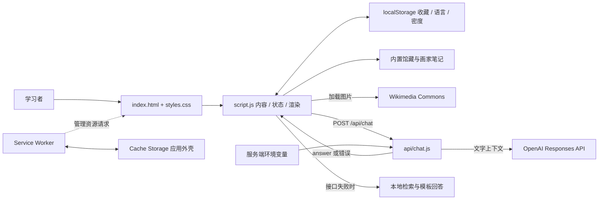
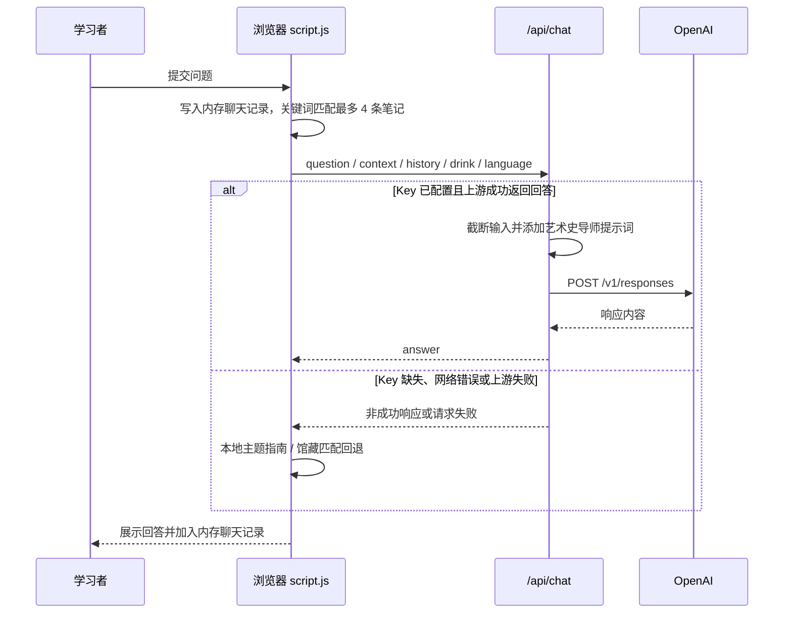

# 架构说明

代码核对日期：2026-09-19。本页记录当前实现；末尾的演进方向尚未实施。项目使用说明见 [README](../README.md)。

## 一张图看清项目

这是一个以浏览器为主要运行环境的单页学习应用。页面内容与学习交互由静态文件完成，只有 Café 的真实 AI 回答需要服务端。



没有独立的数据服务、数据库、队列、向量库、服务端页面渲染或前端打包器。项目里的 npm 仅提供开发命令。

## 模块职责与代码入口

| 文件 / 区域 | 职责 | 关键入口 |
| --- | --- | --- |
| [index.html](../index.html) | 固定 DOM、导航、表单、学习区域容器 | `#cafe-room`、`#essay-room`、`#map-room`、`#greek-art`、`#collection-atlas`、`#study-room`、`#notebook` |
| [styles.css](../styles.css) | 主题变量、作品卡片、展厅、转场、响应式布局 | `:root`、各区域 class、文件末尾的媒体查询 |
| [script.js](../script.js) 前半部 | 英文内容、时代索引、中文内容覆盖、画家档案 | `greekWorks`、`collectionWorks`、`collectionEras`、`zhContent`、`painters` |
| `script.js` 状态与渲染 | DOM 引用、界面翻译、内存状态、区域更新 | `translations`、`state`、`renderCollection()`、`renderDossier()`、`renderChronology()` |
| `script.js` 学习交互 | 收藏、复习、写作题目与本地评分 | `toggleStudyWork()`、`renderStudyCard()`、`renderEssayRoom()`、`scoreEssayResponse()` |
| `script.js` 问答 | 关键词匹配、上下文整理、接口调用、失败回退 | `rankedArtMatches()`、`buildArtContext()`、`artHistorianReply()`、`localArtHistorianReply()` |
| [api/chat.js](../api/chat.js) | 请求裁剪、提示词、服务端调用模型、提取回答 | `handler()`、`SYSTEM_PROMPT`、`extractOutputText()` |
| [service-worker.js](../service-worker.js) | 预缓存外壳、请求缓存与离线回退 | `APP_SHELL`、`CACHE_NAME`、install / activate / fetch 事件 |
| [manifest.webmanifest](../manifest.webmanifest) | PWA 名称、图标、启动地址、快捷方式 | `start_url`、`scope`、`icons`、`shortcuts` |
| [scripts/dev-server.cjs](../scripts/dev-server.cjs) | 本地静态资源服务与原有 API 的 HTTP 适配 | 读取 `.env`，解析 JSON，补齐 `response.status()` / `response.json()` |

`script.js` 是传统浏览器脚本，位于 HTML 末尾加载，没有模块导入。它读取 localStorage，创建状态，绑定事件，再依次调用各区域渲染函数。事件通常修改 `state` 并重新生成对应区域的 DOM；不存在统一的响应式状态框架。

Café、地图、写作区通过移除 `hidden` 并滚动进入；其他区域也使用锚点和滚动定位。这里没有客户端路由器。部分入口只靠按钮打开，不能假设每个 hash 都能恢复对应页面状态；例如 manifest 的 `#map-room` 快捷入口没有专门处理隐藏面板的逻辑。

## 内容模型与关联

内容的当前真源是 `script.js` 中的对象与数组，更新内容需要修改文件并重新发布。

| 数据集合 | 当前数量 | 核心字段与关系 |
| --- | --- | --- |
| `collectionWorks` | 22 | `id`、`category`、`title`、`date`、`culture`、`image`、`context`、`visual[]`、`implications`、`questions[]`、`source`、`sourceUrl` |
| `collectionEras` | 6 | `id`、`number`、`label`、`range`、`summary`、`workIds[]`；通过作品 ID 组织展厅 |
| `painters` | 17 | `id`、`name`、`years`、`country`、`period`、`movement`、`hook`、`position`、`sources[]`、`works[]` |
| `painters[].works` | 共 34 条 | 作品标题、年代、图片、视觉分析、背景及 `exam` 学习提示；有些与馆藏重复 |
| `greekWorks` | 4 | 希腊艺术入门卡片，包含作品图像和说明 |
| `zhContent` / `translations` | 按键组织 | 中文内容覆盖与英中法界面文案；不是三套完整内容库 |
| `conceptGuides` | 主题指南 | 关键词、关联馆藏 ID 与预写回答，用于本地问答回退 |

初始化时，`collectionEraByWorkId` 从时代的 `workIds` 建立索引，再给馆藏作品补上 `period`、`periodRange`、`periodNumber`、`periodId`。新增作品必须同时加入某个时代，否则可能存在于数据数组中却不显示在时代展厅。

画家作品和馆藏作品没有统一外键：`findCollectionWorkForPainterWork()` / `findPainterForCollectionWork()` 用规范化后的标题做匹配。改标题可能让“打开画家档案”或“打开馆藏详情”的关联消失。中文馆藏翻译以 ID 为键，希腊入门翻译以标题为键；修改时需要分别核对。

时间轴通过 `parseStartYear()`、`parseYearRange()` 从描述性年代文本提取数字，再映射到公元前 600 年至公元 1900 年的展示范围。它是近似的视觉定位，超出范围会被压到边缘，不是严谨的年代数据库。

## 状态保存与学习流程

| 状态 | 保存位置 | 刷新后的行为 |
| --- | --- | --- |
| `ahcrSavedStudyIds` | localStorage，JSON 编码的馆藏 ID 数组 | 保留当前浏览器、当前 origin 的收藏 |
| `ahcrLanguage` | localStorage | 恢复 `en` / `zh` / `fr`，非法值回到英文 |
| `ahcrCardDensity` | localStorage | 恢复 compact / expanded 显示密度 |
| `state` | JavaScript 内存 | 重置筛选、选中作品、练习索引和揭晓状态 |
| `chatHistory` | JavaScript 内存 | 聊天记录不恢复 |
| 写作观点、正文和反馈 | 表单 DOM / 内存 | 没有持久保存或跨设备同步 |
| 应用外壳 | Cache Storage | 供 Service Worker 离线加载，不是学习数据备份 |

**复习流程：** 收藏通过 `toggleStudyWork()` 更新 ID 集合。`currentStudyPool()` 有有效收藏时使用收藏，否则使用所有馆藏。图片模式或线索模式显示提示，点击 Reveal 才展示答案。当前没有答题记录、掌握度计算或间隔重复调度。

**写作流程：** 视觉分析模式使用全馆藏；Essay 模式有收藏时使用收藏池。`scoreEssayResponse()` 根据文本长度、视觉术语、作品标题词、论点和意义词等计算最高 10 分的规则分数，Essay 模式还加入历史语境指标。评分完全在本地执行，不调用 `/api/chat`，也不会分析图片、验证事实或判断论证是否成立。

## AI 问答的数据流



1. `questionTokens()` 做大小写、标点、停用词和少量英文同义词处理；中文没有独立分词器。
2. `collectionSearchItems()` 将馆藏和画家笔记整理成检索项。`rankedArtMatches()` 按标题命中、正文命中等排序，最多返回 4 项；这是关键词检索，没有 embedding 或向量数据库。
3. `buildArtContext()` 拼接标题、时代、背景、视觉分析、意义及问题。浏览器将上下文发送到接口；服务端不会重新检索或验证其来源。
4. 前端发送最近 6 条 `chatHistory`。当前问题在调用前已经入列，所以也可能出现在 history 中；后端把 history 作为一段文字上下文，而不是逐条恢复为模型会话消息。
5. 服务端用环境变量中的 Key 发起 OpenAI Responses 请求，`max_output_tokens` 为 700，回答语言映射为英文、简体中文或法文。当前是一次性 JSON 回答，没有流式传输。
6. 前端遇到非成功状态、网络失败、无法解析的响应或空回答时，调用 `localArtHistorianReply()`。主题指南、作品笔记和预写模板生成临时答案，不代表模型调用成功。

模型请求仅包含文字。作品图片由浏览器直接加载；AI 当前不会读取图片像素，也没有实时浏览来源网站。最终回答没有自动引用核验环节。

### `/api/chat` 接口约定

```http
POST /api/chat
Content-Type: application/json
```

```json
{
  "question": "Why is Olympia modern?",
  "context": "Relevant collection notes...",
  "drink": "Latte",
  "history": [{ "role": "user", "content": "Tell me about Manet." }],
  "language": "en"
}
```

| 输入 | 后端处理 |
| --- | --- |
| `question` | 转字符串、trim，截断到 1,200 个 JavaScript 字符单位，不能为空 |
| `context` | 转字符串、trim，截断到 8,000 个字符单位 |
| `history` | 仅数组生效，最多最后 8 项；每项 content 转字符串并截断到 800 个字符单位 |
| `language` | `zh` → 简体中文；`fr` → 法文；其他 → 英文 |
| `drink` | 默认 `coffee`，直接插入文本提示 |

成功响应为 `{ "answer": "..." }`。常见返回如下：

| HTTP 状态 | 含义 |
| --- | --- |
| 200 | 已处理上游成功响应；前端仍会检查 answer 非空 |
| 204 | OPTIONS 预检 |
| 400 | Key 已配置时发现问题为空；本地适配器也用该状态拒绝无效 JSON / 非对象 body |
| 405 | 不支持的方法，`Allow: POST` |
| 503 | `OPENAI_API_KEY` 为空，返回 `needsConfiguration: true`；此检查先于问题校验 |
| 上游错误状态 | 透传 OpenAI 的 HTTP 错误状态和错误文字 |
| 500 | 网络异常、响应解析等未正常处理的异常 |

本地适配器另设 64 KiB 请求体上限，超出返回 413。此限制不在 `api/chat.js` 内，不能当成云端已实施的限制。API 当前设置 `Access-Control-Allow-Origin: *`，没有登录鉴权、限流、专门的请求超时、重试或输入 schema 全量验证；history 项的内部结构也未完整校验。

## 本地运行与托管边界

`scripts/setup.cjs` 只负责创建 `.env`，通过排他复制保留已有文件。`scripts/dev-server.cjs` 读取 `.env`，在 `127.0.0.1` 上提供页面，并适配 `api/chat.js` 所需的请求与响应形态。服务器仅允许指定页面和 `assets/` 图片路径，避免把 `.env`、`.git` 或服务端源码当成静态文件返回。

本地适配器不替换 API 业务逻辑，也不是云端部署运行时。Vercel 可以按 `api/chat.js` 路径运行函数；纯静态托管只运行浏览器部分；其他 Node.js 平台需自行适配函数调用。浏览器使用绝对路径 `/api/chat`，若将站点部署在子路径，必须确认该接口路由仍位于域名根路径。

Node.js 依赖声明为 22 及以上，`.nvmrc` 建议 24。当前没有第三方运行库、打包产物或 CI 配置。本次验证环境是 Node.js v25.8.2，不应视为所有声明版本都已逐一验证。

## PWA 与缓存

当前缓存名称为 `art-historian-common-room-v13`，HTML 中 CSS/JS 带 `?v=13`。

| 阶段 / 请求类型 | 当前策略 |
| --- | --- |
| install | `cache.addAll(APP_SHELL)` 预缓存首页、离线页、CSS/JS、manifest 与本地素材，完成后 `skipWaiting()` |
| activate | 删除当前 origin 下名称不等于当前缓存名的所有缓存，然后 `clients.claim()` |
| 页面导航 | 网络优先；成功时保存响应为 `index.html`；断网回退缓存首页，再回退 offline 页 |
| 同源非导航 GET | 缓存优先，未命中时请求网络并缓存成功响应 |
| 跨源 GET | 发起网络请求，失败时尝试已有缓存；这里并没有主动缓存外部作品图片 |
| 非 GET | 不由此 Worker 处理，因此 AI POST 不会进入离线缓存 |

需特别注意三点：

- 预缓存列表是无查询参数的 `script.js` / `styles.css`，页面实际请求带 `?v=13` 的地址。带版本地址需在联网运行时另外进入缓存，不能仅凭 Worker 安装完成就宣称完整离线可用。
- 同源资源采用缓存优先，开发时仅设置 HTTP `no-store` 不能清除已有的 Worker 缓存。发布资源更新时，需同步修改 `CACHE_NAME` 与 HTML 引用版本，并实际测试更新和离线流程。
- activate 当前会删除该 origin 下其他名称的缓存，没有限定本应用前缀。同一域名托管其他应用时，需要评估冲突。

以上是现有行为的说明，本次初始化没有改写缓存机制。

## 修改入口

| 想做的改动 | 从哪里开始 | 一起核对什么 |
| --- | --- | --- |
| 新增馆藏作品 | `collectionWorks` | 唯一且稳定的 ID、所属时代 `workIds`、中文覆盖、图像与来源、复习显示 |
| 新增画家或作品笔记 | `painters` | 筛选项、时间轴、与馆藏标题的匹配关系 |
| 增加或调整时代 | `collectionEras` | 作品归属、地图、时代筛选、中文时代标签 |
| 修改页面结构 | `index.html` | `script.js` 选择器、CSS class、隐藏区域打开逻辑 |
| 改视觉与移动端布局 | `styles.css` | 窄屏、键盘操作、减少动画设置、图片载入失败时的布局 |
| 补全翻译 | `translations`、`zhContent` 和各处硬编码文本 | 切换后所有动态区域是否重绘，画家与写作区是否仍残留英文 |
| 修改问答检索或回退 | `rankedArtMatches()` / `localArtHistorianReply()` | 无匹配、中文问题、接口失败时的回答与提示 |
| 修改模型行为 | `api/chat.js` | 提示词、模型配置、输入上限、错误响应和真实服务验证 |
| 修改写作评分 | `scoreEssayResponse()` | 明确规则分数含义，不将其宣传成 AI 或专业评阅 |
| 修改缓存与安装体验 | `service-worker.js`、manifest、HTML 引用版本 | 首次访问、二次访问、升级、离线、快捷入口 |

## 验证范围与后续演进

`npm run check` 提供语法检查；`npm test` 覆盖初始化不覆盖配置、静态资源与版本查询参数、私有文件拒绝访问、未配置 Key 的真实 handler 行为、无效及超限请求体。测试使用空 Key，不向 OpenAI 发起请求。它们不替代浏览器交互、PWA 安装、内容学术准确性或云端验收。

2026-09-19 的本地 Chrome 实测另已通过：打开时代地图并进入 Modernity 展厅、收藏后刷新仍保留、复习揭晓答案、未配置 Key 时返回本地笔记、提交写作后返回规则评分。本次没有验证真实 OpenAI、手机安装或离线升级流程。

手工检查可沿以下流程执行：选择一个时代并打开作品；收藏后刷新确认仍在；切换图像/线索卡片并揭晓答案；筛选并打开画家；在写作区提交文本；在 Café 验证未配置时回退；切换中英法；最后单独验证联网缓存后的离线表现。

后续可按实际需求演进，以下均未实施：

1. 先给作品建立稳定的统一关联 ID，再把内容、翻译与交互从 `script.js` 分离，降低修改一处牵动多个模块的成本。
2. 若要公开提供真实 AI，补充访问控制、用量限制、超时和可观察的错误分类。
3. 若要持续学习记录，设计草稿与练习记录保存；需要跨设备使用时再引入账号和数据库。
4. 独立补齐翻译、图片加载失败处理、缓存版本一致性与自动化浏览器检查。
