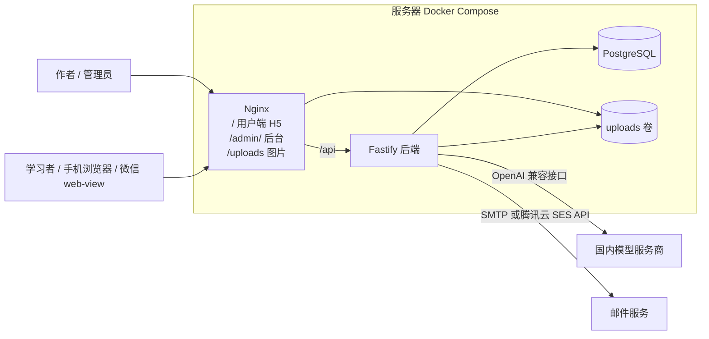
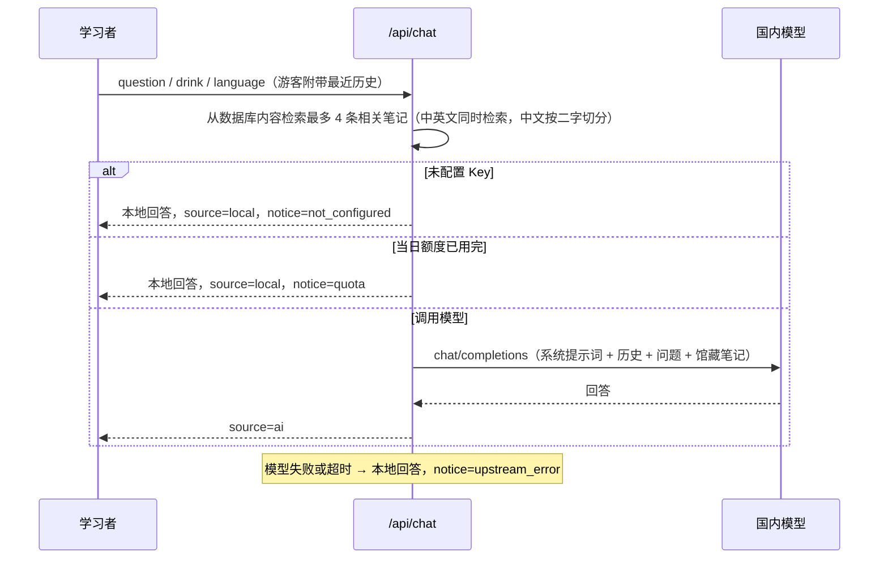

# 架构说明

代码核对日期：2026-09-30。本页记录当前实现。使用与部署说明见 [README](../README.md) 与 [deploy/README.md](../deploy/README.md)。

## 一张图看清项目

```mermaid
flowchart LR
    User[学习者 / 手机浏览器 / 微信 web-view] --> Nginx
    Author[作者 / 管理员] --> Nginx
    subgraph 服务器 Docker Compose
      Nginx[Nginx<br/>/ 用户端 H5<br/>/admin/ 后台<br/>/uploads 图片] -->|/api| Server[Fastify 后端]
      Server --> PG[(PostgreSQL)]
      Server --> Uploads[(uploads 卷)]
      Nginx --> Uploads
    end
    Server -->|OpenAI 兼容接口| LLM[国内模型服务商]
    Server -->|SMTP 或腾讯云 SES API| Mail[邮件服务]
```

- 用户端与后台都是静态单页应用，和 API 同域，使用 httpOnly Cookie 会话，无需跨域。
- 内容（时代、作品、画家等）存于数据库，后台修改后立即生效；后端对公开内容做内存缓存，写入时失效。
- 作品图片存放在本站 `uploads`，不依赖 Wikimedia。

## 代码结构

| 目录 | 职责 | 关键入口 |
| --- | --- | --- |
| `packages/shared` | 前后端共享的枚举、zod 请求校验、DTO 类型、`pickLocale()` | `src/index.ts` |
| `apps/server/src/db/schema.ts` | 全部表结构（Drizzle） | 迁移在 `apps/server/drizzle/` |
| `apps/server/src/app.ts` | 组装 Fastify：Cookie、频率限制、上传、来源校验、会话、错误处理、路由 | `buildApp()`（测试注入内存数据库与桩服务） |
| `apps/server/src/routes/` | `content`（公开内容）、`auth`、`me`（个人数据）、`chat`、`workshop`、`admin/*` | |
| `apps/server/src/lib/` | `content.ts` 内容快照与按语言展开；`historian.ts` 检索、本地回退回答与模型调用；`seed.ts` 初始内容写入；`images.ts` 图片处理；`security.ts` 密码与验证码哈希 | |
| `apps/web/src` | 用户端。`views/` 页面、`components/` 首页各展厅、`stores/` 状态、`i18n/` 界面文案 | `router.ts` |
| `apps/web/src/styles/legacy.css` | 旧版样式（删除了未使用的部分），组件沿用旧版 DOM 结构与 class | `app.css` 为新增页面样式 |
| `apps/admin/src` | 后台。`lib/entities.ts` 描述各类内容的字段，`ContentView` 据此生成中英并排编辑表单 | |
| `scripts/extract-legacy-content.mjs` | 从 `legacy/script.js` 抽取内容生成 seed，合并 `scripts/translations/zh-*.json` 中文初稿 | |
| `legacy/` | 旧版原生单页，保留作对照，不再部署 | |

## 数据模型

| 表 | 说明 |
| --- | --- |
| `eras`、`works`、`greek_highlights`、`painters`、`painter_works`、`concept_guides`、`coffee_options` | 内容。可翻译字段是 `jsonb` 的 `{ en, zh }`（列表为 `{ en: [], zh: [] }`）；`zh_status` 为 `missing / draft / reviewed` |
| `images` | 图片路径、尺寸、作者、许可证与来源页 |
| `users`、`sessions`、`email_codes` | 账号、会话（只存 token 的 SHA-256）、邮箱验证码（只存 HMAC） |
| `saved_works`、`essay_drafts`、`chat_messages` | 个人学习数据 |
| `submissions`、`replies` | 提交给作者的固定版本与作者回复 |
| `workshop_applications` | 工作坊意向申请 |
| `usage_counters` | 按日计数（AI 额度） |
| `site_settings` | 后台可调的设置（提交开关与容量、工作坊文案、AI 额度） |

关键关系与约定：

- **作品 `slug` 沿用旧版 `id`**（如 `olympia-collection`），是收藏、草稿、提交的关联键，不应修改。
- 作品通过 `era_id` 归属时代，取代旧版 `collectionEras.workIds`；排序由 `sort_order` 决定。
- 画家作品通过 `painter_works.work_id` **显式关联**馆藏作品，取代旧版的标题匹配（34 条中 4 条有关联）。希腊入门卡通过 `work_id` 关联馆藏。
- 年代线使用数值字段 `start_year / end_year / birth_year / death_year`（公元前为负数），由抽取脚本从年代文字解析，可在后台修正。
- 画家筛选用稳定的 `country_key / period_key`，显示用双语标签。

## 请求与权限

| 路径 | 权限 | 说明 |
| --- | --- | --- |
| `GET /api/content?lang=zh\|en` | 公开 | 一次返回按语言展开的全部公开内容（缺中文时回退英文） |
| `/api/auth/*` | 公开 / 登录 | `send-code`、`register`、`login`、`logout`、`reset-password`、`me`、`change-password` |
| `/api/me/*` | 登录 | 收藏（含游客收藏合并）、草稿、提交、问答记录、工作坊申请状态 |
| `POST /api/chat` | 公开 | 登录用户保存记录并使用服务端历史；游客可附带最近 6 条历史 |
| `/api/workshop` | 公开 | 介绍与申请 |
| `/api/admin/*` | 作者 / 管理员 | 用户管理与修改设置仅管理员 |

安全措施：

- 密码用 scrypt 加盐哈希；验证码 6 位、10 分钟有效、最多试 5 次、同邮箱同用途 60 秒冷却、每日 10 次。找回密码不暴露邮箱是否注册。
- 会话 Cookie：`httpOnly`、`SameSite=Lax`、生产环境 `Secure`，30 天滑动有效期；重置密码或停用账号会清除该用户全部会话。
- 写请求校验 `Origin` 必须在 `APP_ORIGIN` 中；请求体全部经 zod 校验。
- 登录、发码、注册、问答、申请均有按 IP 的频率限制；Nginx 以 `$remote_addr` 覆盖 `X-Forwarded-For`，避免伪造来源 IP。
- 工作坊表单含蜜罐字段；CSV 导出对以 `= + - @` 开头的单元格加前缀，防止表格公式注入。
- 权限在服务端校验，后台界面隐藏菜单只是辅助。

## 艺术史问答

```mermaid
sequenceDiagram
    participant U as 学习者
    participant S as /api/chat
    participant O as 国内模型
    U->>S: question / drink / language（游客附带最近历史）
    S->>S: 从数据库内容检索最多 4 条相关笔记（中英文同时检索，中文按二字切分）
    alt 未配置 Key
        S-->>U: 本地回答，source=local，notice=not_configured
    else 当日额度已用完
        S-->>U: 本地回答，source=local，notice=quota
    else 调用模型
        S->>O: chat/completions（系统提示词 + 历史 + 问题 + 馆藏笔记）
        O-->>S: 回答
        S-->>U: source=ai
    end
    Note over S: 模型失败或超时 → 本地回答，notice=upstream_error
```

- 模型接口为 OpenAI 兼容的 `chat/completions`，由 `AI_BASE_URL / AI_API_KEY / AI_MODEL` 配置，默认 DeepSeek。
- 检索上下文在服务端生成，不再信任前端传来的上下文。
- 本地回答由问答主题（`concept_guides`）与作品笔记组合，逻辑移植自旧版 `localArtHistorianReply()`。
- 额度按北京时间自然日计：登录用户按账号、游客按 IP，数值在后台设置。

## 写作练习与作者回应

- 练习反馈 `apps/web/src/lib/essay.ts` 在浏览器本地按字数、视觉词汇、标题提及、论点与意义表达打分，**不调用模型**。中英文标题都参与匹配。
- 草稿按「作品 + 模式」保存：登录用户防抖后写入 `essay_drafts`，并在本机保留备份直到保存成功；游客只存本机，登录后首次打开时写入账号。
- 提交保存当时的固定版本。每位用户同时只能有一份待回应；待回应总数达到容量或关闭接收时拒绝新提交（事务内加咨询锁，避免并发超额）。
- 状态：`pending → replied → closed`，或 `pending → withdrawn`；作者也可带原因直接结束。回复先存草稿，发送后不可修改，并邮件通知用户。

## 发信

`apps/server/src/lib/mailer.ts` 把每封邮件定义为带类型的消息（`register_code`、`reset_code`、`reply_notice`、`author_notice`），同时生成纯文本正文和模板变量：

- `smtp`：nodemailer 发送主题与纯文本正文。
- `tencent_ses`：调用腾讯云 SES `SendEmail` API（TC3-HMAC-SHA256 签名，与官方 Node SDK 一致），按类型选择模板 ID，`TriggerType=1`。个人认证账号只能用这种方式。通知模板中的链接写死域名 `https://art.llmxfactor.cloud/{{url}}`（腾讯云审核要求），`url` 只传站内路径（`me?tab=submissions`、`admin/`）。
- `log`：只写日志（开发环境）。

验证码邮件发送失败时返回 `502 mail_failed`，并删除刚生成的验证码，用户可以立即重试。通知邮件失败只记日志，不影响主流程。通知作者的邮件只含摘要，不含用户联系方式。

## 部署形态

- **功能开关** `ACCOUNTS_ENABLED`：为 `false` 时后端拒绝发码、注册、找回密码，普通用户不能登录、旧会话不生效；前端构建时隐藏登录入口、我的书房与「请作者看看」，并把相关路由重定向到首页。作者与管理员仍可登录后台。

- `deploy/Dockerfile.server`：构建后端（tsup 打包，`pnpm deploy --prod` 生成精简依赖）。容器启动时依次执行迁移、补齐初始内容（`seed` 默认只插入缺失记录）、启动服务。
- `deploy/Dockerfile.web`：构建用户端与后台，放入 Nginx 镜像。备案号与运营者信息在构建时写入。
- 多站点服务器上采用「宿主机 Nginx（HTTPS）→ 容器 Nginx（127.0.0.1:3040，`TLS=off`）」两层代理；容器 Nginx 通过 `real_ip` 从 `X-Real-IP` 恢复访客 IP。
- Nginx：`/` 与 `/admin/` 做 history 路由回退，`/api/` 反代后端，`/uploads/` 直接读取共享卷，根路径 `*.txt` 从 `deploy/verify/` 提供（小程序业务域名校验）。`TLS=on/off` 切换 HTTPS 配置。
- 首版不使用 Service Worker：微信 web-view 中作用有限，且旧版的缓存优先策略容易让用户停留在旧版本。

## 验证范围

- `pnpm test`：后端 26 项测试（集成测试含关闭公众账号的情况；另有 SES 签名、模板选择、通知链接与模板文档一致性、错误处理与验证码发送失败回滚），覆盖内容接口、注册 / 登录 / 找回密码、验证码限制、来源校验、收藏合并、草稿、提交与容量、作者回复、用户停用、后台内容修改、工作坊申请与 CSV、问答的本地回退 / 模型调用 / 失败 / 额度。使用内存 PostgreSQL（PGlite）、内存邮件与桩模型。前端 4 项写作反馈单元测试。
- `pnpm e2e`：Playwright 浏览器流程（游客收藏 → 注册合并 → 草稿保存与刷新 → 提交 → 问答 → 申请 → 后台回复 → 用户看到回复 → 中英切换 → 375px 窄屏无横向溢出）。已分别在开发服务器和本地 Docker 生产构建（Nginx）上通过。
- 尚未验证：真实国内模型调用、真实 SMTP 发信、正式域名与证书、国内服务器上的镜像拉取与构建、微信 web-view 与小程序审核、中文初稿的学术准确性。

## 后续可以做的

1. 作者审校「中文待审」内容（后台概览显示剩余数量）。
2. 学习路线、作品比较与运营事件记录（见 [下一阶段执行方案](NEXT_STAGE_EXECUTION_PLAN.md)）。
3. 如需微信一键登录，可在小程序中获取 code 换取会话，再与邮箱账号绑定。
4. 图片量增大后迁移到对象存储 + CDN（`images.path` 已是完整 URL 路径，可直接替换前缀）。
