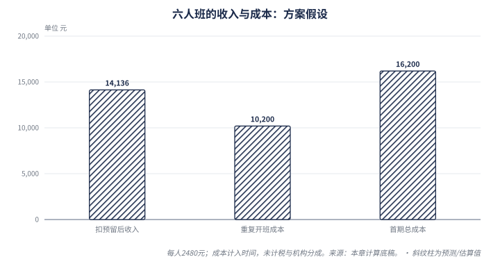

# A-level 艺术史：商业机会与执行方案

> 报告日期 2026-09-19　·　Common Room · 中国大陆及海外华语学生 · 公开资料研究与试点建议

---

## 决策摘要

▌ **建议**：把 Common Room 的第一个商业试点定位为“艺术史 A-level 英文论证与反馈工作坊”，先验证一期有边界的服务；当前不投入完整培训课程或大规模平台建设。🔴判断／中

**为什么这样选：** 评论中存在考试相关线索，但付费需求尚未验证；公开供给已经包含完整网课和人工辅导。项目若有机会，需要具体证明：能接触到某类学生，解决已有教学未解决的问题，并以可持续成本交付。🟡推导

| 现在作出的选择 | 依据与下一步 |
| --- | --- |
| 优先在读 9HT0 华语学生 | 可核对真实作业、选修组合和期限；可触达人数仍未知。🔴判断 |
| 四周、目标 6 人的专项服务 | 先匹配共同主题，观察首稿、反馈、修改和迁移；规模是试验假设。🔴方案 |
| 2,480 元／人为首次报价假设 | 成本模型在重复交付条件下留有余量；尚无中国成交价证明。🟡计算／⚪缺失 |
| 首期接受多少损失，开班前说明 | 示例模型计入人工后首期余量 −2,064 元，重复开班为 3,936 元，均未含实际税额等缺失费用。🟡计算，见第 6 章 |
| 免费参观继续保留 | 正式提交与长期反馈记录需要身份；首期可借可靠工具交付，再补网站。🔴判断 |
| 先核实、再收款 | 教师样课、学生适配、考试安排和经营条件未满足，不进入收费教学。🔴判断 |

**改变判断的条件：** 找不到适配的实际付款者、教师无法提供可靠反馈，或实际成本超过可接受收费，就停止这一服务组合。若非考试能力训练或学校委托率先出现有预算的真实需求，再调整业务次序。🔴判断

**研究范围与证据边界：** 中国大陆及海外华语学生为主要商业对象，英国用于核对资格、供给和价格。公开网页截至 2026-09-19；中国人数、实际成交、作者教学能力与学习效果尚缺一手验证。本报告交付的是业务选择和验证方案，未实施招生、收款、开发或对外联系。⚪

快速阅读：需要先做什么看第 5、8 章；担心是否赚钱看第 6 章；想核对市场依据看第 2–4 章。价格、班额和访谈数量都是可调整的试验参数，不是行业规律。

---

## 阅读说明（先看这一条）

> **报告里的颜色＝这句话的依据性质，不代表「好消息还是坏消息」。**
>
> 🟢 有据可查的事实　🟡 我们从事实推出来的　🔴 研究判断或建议　🟠 机构或受访者的说法（未独立核实）　⚪ 查不到 / 缺失
>
> ⚠ 红色 🔴 是「这是我们的判断」，**不等于「危险 / 利空」**——某条结论是利好还是利空，看判断那句话本身怎么写，不看颜色。

---

## 目录

- 1. 先找到愿意为具体学习任务付费的人
- 2. 考试、艺术设计与申请能力是三种产品
- 3. 英国供给不均，中国商业缺口仍待验证
- 4. 现有课程卖什么，我们必须多解决什么
- 5. 先做哪门生意，以及首期究竟交付什么
- 6. 把作者时间算进去，学费还剩多少
- 7. Common Room 如何成为可靠的学习服务
- 8. 六周验证安排，以及继续或停止的条件
- 9. 依据、信息缺口与后续核实

---

## 1. 先找到愿意为具体学习任务付费的人

▌ **本章核心判断**：🔴 先服务有当期作业与考试任务的人；评论区兴趣只能作为访谈入口。〔判断／中〕

- 🟢 事实：用户提供的评论片段同时出现试用申请、系统学习愿望与考试相关身份自述；这些是不同需求线索。
- ⚪ 缺失：尚无课程购买、真实答卷、复购或教师服务耗时，无法判断谁愿意付多少钱。
- 🔴 判断/中：先检验已在读 9HT0 学生的专项反馈需求；依据是任务较具体，不确定性在触达与真实付费意愿。

### 从评论中能确认到哪一步

这批材料由用户转述，未独立核实账号身份，也不是完整评论样本（⚪缺失）。其中能直接观察到的是“有人表达了什么”，不能据此确认其在读科目、付费能力或学习困难（🟡推导：表达记录与身份、交易证据不同）。

| 评论线索 | 可以提出的需求假设 | 仍需核实 |
| --- | --- | --- |
| 🟠 主张：自述为艺术史 A-level 学生 | 🔴 判断/中：可能需要当期作业或备考帮助 | ⚪ 缺失：考试局、代码、主题、现有教师支持 |
| 🟠 主张：自述协助艺术史 A-level 教学 | 🔴 判断/中：可能成为教研与招生伙伴 | ⚪ 缺失：可带来的学生、合作权限与预算 |
| 🟠 主张：自述知识零碎、希望系统学习或看懂画作 | 🔴 判断/中：可能接受有作品任务的短课 | ⚪ 缺失：学习期限、投入习惯与购买理由 |
| 🟢 事实：片段中多次出现申请试用、求入口和设计赞赏 | 🔴 判断/中：可测试免费体验吸引力 | ⚪ 缺失：实际打开、完成任务、再次使用与付款 |

“92 条评论”来自所提供页面描述（🟠主张，用户提供材料）；页面片段同时呈现作者回复，无法据此确认独立留言者数量（⚪缺失）。把它当作有效潜客数量，会把讨论热度变成虚构的销售机会（🟡推导）。

### 学生使用、家长付款、教师推荐，需要分别成立

下表是待访谈验证的购买关系假设，不是已确认的客户画像（🔴判断/中）。其依据是课程涉及学习、支付和教学配合；实际决策权尚缺记录（⚪缺失）。

| 角色 | 首要任务与关注点〔🔴判断/中〕 | 能验证购买关系的证据 |
| --- | --- | --- |
| 学生 | 当前文章哪里有问题，怎样完成修改，新增课程是否挤占已有学习时间 | 最近作业、原教师反馈、愿意完成的修改 |
| 家长／实际付款人 | 教师能否解决具体困难，服务范围、进度与收费是否清楚 | 谁做购买决定、买过什么、何时愿付款 |
| 教师／学校 | 选修主题能否匹配，批改能否减轻工作，责任如何分配 | 可转介学生、共同样课；采购须另确认预算 |

教师愿意推荐与学校愿意采购之间，还隔着预算和授权（⚪缺失）。因此学校合作先作为接触学生、核对教学质量的渠道假设；没有采购证据前不建设学校管理平台（🔴判断/中，依据是尚无机构订单，不确定性是合作方实际需求）。

### 可能缺的是哪一段教学

> **推演**  
> **前提**：评论片段中既有考试相关身份自述，也有泛兴趣表达；尚无真实作业与交易记录（🟠主张／⚪缺失）。  
> **逻辑**：同样申请试用，可能是在找免费资料，也可能在解决下一次作业；两者不能用同一套课程报价验证（🔴判断/中）。  
> **推导**：先围绕真实作业定位困难，再提供限定反馈，才有条件观察购买与修改行为（🔴判断/中，待试点验证）。  
> **结论**：先服务有当期作业与考试任务的人；评论区兴趣只能作为访谈入口。🔴判断／中

建议把服务放在“观察作品—选择证据—组织英文论证—得到反馈—自主修改”这段过程（🔴判断/中）。依据是它能产生可比较的作品；不确定性是学生是否缺少这类帮助。Common Room 的参观氛围可以吸引体验，但不能代替教师的具体判断（🔴判断/中）。

教学示例：学生先列出画面细节，再解释它如何支持观点，最后检查历史材料是否真的支撑该解释；教师针对断裂处提问，由学生重写（🔴判断/中，教学设计示例，并非真实学生案例）。据此应验证的是“能否在反馈后自行修改”，而非只看学生是否喜欢点评（🔴判断/中）。

首选对象暂限已在读 9HT0、能提供选修信息和近期练习的华语学生；先试四周专项反馈，不承接完整课程（🔴判断/中，依据是可缩小教学与验证范围，师资适配仍待核实）。非考试能力短课另组验证，避免把兴趣参与率当作考生购买意愿（🔴判断/中）。

**反转条件：** 若难以接触真实在读生，或学生原有教师已经充分解决问题，就降低考试服务的优先级；若需要帮助的人不愿付费，也不能仅凭学习价值扩大招生（🔴判断/中）。若学校能提供明确学生名单、预算与责任安排，则重新比较机构合作路径（🔴判断/中，当前这些证据缺失）。

**本章判断：** 先核对真实学习任务和付款关系，再定义产品。下一章划清这项服务能承诺的资格与能力范围。🔴

---

## 2. 考试、艺术设计与申请能力是三种产品

▌ **本章核心判断**：🔴 以 9HT0 为首个资格边界，按选修组合教学；不把创作课、作品集和升学能力混成一门课程。〔判断／中〕

- 🟢 事实：本次艺术史考试研究对象是 Pearson Edexcel **GCE A-level History of Art，代码 9HT0**；“可在国际地区提供”不等于资格名叫 International A Level。[官方资格页](https://qualifications.pearson.com/en/qualifications/edexcel-a-levels/history-of-art-2017.html)
- 🟡 推导：艺术史论述、艺术设计创作和申请材料的考核对象不同，课程内容及成功标准需要分开。
- 🔴 判断/中：先限定能教的主题与时期；依据是考纲存在选修组合，教师覆盖能力尚未核实。

### 名字相近，交付内容不同

| 方向 | 已核实的资格或任务边界 | 对 Common Room 的含义〔🔴判断/中〕 |
| --- | --- | --- |
| 艺术史 History of Art | 🟢 事实：9HT0 以视觉分析、历史语境和论证为核心。[Pearson 考纲](https://qualifications.pearson.com/content/dam/pdf/A%20Level/history-of-art/2017/specification-and-sample-assessments/specification-and-sample-assessments-GCE-HISOFART-SPEC.pdf) | 可以测试作品分析与英文写作反馈；教师能力须按专题验证 |
| 艺术与设计 Art & Design | 🟢 事实：本次核对的 Cambridge 9479 包含课程作业、命题作业与个人研究，并不接受私人考生。[2026 考纲](https://www.cambridgeinternational.org/Images/697364-2026-syllabus.pdf) | 需要创作过程与作品指导；不能拿艺术史笔试课程替代 |
| 作品集／申请能力 | 🟢 事实：牛津艺术史申请要求包含写作材料；这与创作类作品集并非同一提交任务。[牛津招生要求](https://www.ox.ac.uk/admissions/undergraduate/courses/course-listing/history-of-art) | 按具体院校与专业核对；不能把“艺术留学”作为统一产品承诺 |

Cambridge 的私人考生限制仅适用于上述已核对的考纲，其他考试局与资格需要分别查证（⚪缺失）。当前未验证 Common Room 作者能指导创作作品集，因此不把这一业务并入首期服务（🔴判断/中，依据是教学对象不同，相关师资证据缺失）。

### 9HT0 需要怎样的教学准备

现行考纲规定两卷各三小时、各占总成绩的一半，以英语作答；内容包含视觉分析、三选二主题和五选二时期（🟢事实）。知识与理解、视觉分析、形成有依据的论证，权重依次为 30%、36%、34%（🟢事实，单源官方规则）。[Pearson 考纲](https://qualifications.pearson.com/content/dam/pdf/A%20Level/history-of-art/2017/specification-and-sample-assessments/specification-and-sample-assessments-GCE-HISOFART-SPEC.pdf)

> **推演**  
> **前提**：9HT0 有选修组合，以英语考核知识、分析和论证（🟢事实，见上述考纲）。  
> **逻辑**：通用艺术史介绍不能自动覆盖某校所选作品，也不能证明学生能独立完成英文论证（🟡推导）。  
> **推导**：报名诊断应先匹配选修范围，再检查学生如何从作品证据形成观点（🔴判断/中，待样课验证）。  
> **结论**：以 9HT0 为首个资格边界，按选修组合教学；不把创作课、作品集和升学能力混成一门课程。🔴判断／中

依据上述要求，专项班至少应核对学校所选主题、时期、作品与近期任务，并说明教师能覆盖哪部分（🔴判断/中）。不确定性在学校安排和教师能力；四周服务不应被描述为覆盖完整考纲。学生的英文困难也需通过答卷区分：可能是表达问题，也可能是缺少作品证据或论点不成立（🔴判断/中，诊断假设，并非已观察到的普遍困难）。

### 升学训练可以独立成立，但资格并非必经之路

牛津艺术史本科不要求预先学过艺术史，要求论述型 A-level 科目；Courtauld 同样不要求艺术史背景或特定 A-level 科目（🟢事实，各校政策分别适用）。[牛津](https://www.ox.ac.uk/admissions/undergraduate/courses/course-listing/history-of-art)、[Courtauld](https://courtauld.ac.uk/explore-our-courses/undergraduate/ba-history-of-art/)

因此，“想申请艺术史”不能直接推出“必须增修艺术史 A-level”（🟡推导）。观察、阅读与英文论证短课可以作为独立服务假设，但其购买理由和评价标准必须另测（🔴判断/中）。依据是相关能力有招生材料中的对应任务；不确定性在学生是否需要额外辅导，且现有证据不能证明本课程提高录取率（⚪缺失）。

### 报名通路必须按当期核对

英国文化教育协会中国 2023 年报名指南曾列出 9HT0 两卷（🟢事实，仅历史记录）。[2023 指南](https://www.britishcouncil.cn/sites/default/files/pearson_edexcel_exam_registration_guidance_may_june_2023.pdf) 当前一般考试服务页不能确认具体城市在 2027 年接收该科目私人考生（⚪缺失）。[当前服务页](https://www.britishcouncil.cn/exams/school/pearson)

所以面对尚未选课、打算自学再报名的家庭，应先取得考点当期书面条件，再讨论完整课程安排（🔴判断/中，依据是历史记录不能保证未来服务）。首期优先在读生，可以减少新增报考路径的不确定性；其实际考试安排仍应核对（🔴判断/中）。

**反转条件：** 若接触到的主要人群需要创作作品集或纯兴趣学习，就重新定义产品；若没有匹配选修的教师，或学生考试路径未明确，就不对外承诺科目备考交付（🔴判断/中，依据是服务内容与资格结果必须对应，当前教学和报名信息仍有缺口）。

**本章判断：** 先服务可匹配的在读科目任务；确认资格边界后，下一章检验是否有足够可触达需求。🔴

---

## 3. 英国供给不均，中国商业缺口仍待验证

▌ **本章核心判断**：🔴 小科目可以容纳专业服务，但没有证据支持把中国市场当作大规模蓝海。

- 🟢 英国最新可核查的官方口径是 **715 名当年参考考生**。[Pearson 2026 临时统计，第 6 页](https://qualifications.pearson.com/content/dam/pdf/Support/Grade-statistics/A-level/grade-statistics-june-2026-provisional-advance-level.pdf)
- 🟡 学校开课较少与学生付不起培训费可以同时发生；供给不足不能独立证明商业机会。
- ⚪ 中国考生、可触达学生及实际补课付费人数均缺少可靠统计，暂不计算市场规模或渗透率。

### 先固定人数口径，再谈增长

| 指标 | 本次能确认的内容与边界 |
| --- | --- |
| 2026 年 9HT0 考生 | 🟢 **715 人**；Pearson June 2026 **UK Only、Total Sat、临时统计**。不是全球人数、中国人数、全部在读学生或培训买家。[官方表](https://qualifications.pearson.com/content/dam/pdf/Support/Grade-statistics/A-level/grade-statistics-june-2026-provisional-advance-level.pdf) |
| 2025 年比较基数 | 🟢 AAH 附表列 **838 人**；Pearson 的 HOME 搜索索引也可读到该值。⚪ Pearson 原地址直接访问为 404，且两处可能引用同一上游，不能称两份独立原始验证。[AAH 附表](https://courtauld.ac.uk/wp-content/uploads/2025/11/AAH-report-FINAL.pdf)、[Pearson 原地址](https://qualifications.pearson.com/content/dam/pdf/Support/Grade-statistics/A-level/grade-statistics-june-2025-provisional-advanced-level.pdf) |
| 两年数值对比 | 🟡 在上述口径与访问限制下，715 − 838 = **−123 人**；以 838 为基数，变化为 **−14.68%**。这是可复算的比较，不足以判定长期需求萎缩。 |

🟢 AAH 调查定位了 **80 家**开课的学校、学院及慈善机构，指出供给集中在英格兰、尤其伦敦及东南部；这不是考试中心名录。[AAH 原报告](https://courtauld.ac.uk/wp-content/uploads/2025/11/AAH-report-FINAL.pdf)

🟡 历史增长叙事也有数据问题：同一报告正文称 2019—2025 年增长 42%，附表却列 483→838，按通常的基期定义核算为 **73.50%**；我们采用算式，不采用未经解释的 42%。⚪ 另一个未解冲突是 122 家机构的基年，原报告写 2014，发布新闻写 2016；因此不据此计算学校收缩速度。[原报告](https://courtauld.ac.uk/wp-content/uploads/2025/11/AAH-report-FINAL.pdf)、[发布新闻](https://courtauld.ac.uk/news-blogs/2025/courtauld-association-for-art-history-report/)

🔴 当前证据支持“小科目、供给分布不均”；把低基期反弹或一年的下降延伸成商业趋势都过早，主要不确定性是不同地区的选课、补课和支付行为尚未调查。

### 供给缺少，可能是机会，也可能是班级算不过账

> **推演**
>
> **前提**：🟢 英国当年考生规模有限，课程机构分布不均；⚪ 中国对应科目的考生和补课需求未知，现有依据见上。
>
> **机制**：🟡 教师需要备课与批改；当学生分散、选修组合不同，单个班级不能共享足够教学工时，开课就可能不划算。线上授课能聚集分散学生，但不能自动增加付款人数。
>
> **推导**：🔴 限定主题的小组课有机会改善交付效率，依据是相同任务可以共享讲解；能否成班、每稿耗时是否可控仍待试教。
>
> **结论**：🔴 小科目可以容纳专业服务，但没有证据支持把中国市场当作大规模蓝海。

🔴 最强的反方是：合适学生太少，已有学校老师足够好，剩余需求又碎片化，最终只能形成偶发家教收入。这个反方由有限科目规模和备课、批改成本共同支持；目前缺少真实付费及复购证据，不能将它排除。

⚪ 反方也未获证实：英国统计不含全部海外考生，中文搜索不到人数不等于中国没有需求。下一步应从真实学生任务核实：是否已经选 9HT0、读哪些主题、谁在教、缺哪种反馈、谁决定付款、现有替代花多少钱。艺术留学总人数、Art & Design 考生或小红书评论数，都不能代替这份名单。

🔴 我们仍建议试点，依据是少量学生也可能支撑作者个人的专业服务，且专项反馈无需先建设完整课程；收入持续性和招生稳定性尚未验证。**反转条件**是：能持续找到选修相容、愿意实际付款的学生，且计入招生与教师时间后仍有余量，才上调为稳定业务机会；若反复只有兴趣表达、成班困难或已有老师能充分解决问题，就缩回低频辅导与公共学习内容。

**本章判断：** 小科目支持有限试点，尚不支持规模扩张。下一章比较学生已有的选择，定位额外付费理由。🔴

---

## 4. 现有课程卖什么，我们必须多解决什么

▌ **本章核心判断**：🔴 内容与线上导师已经存在，优势要来自具体主题匹配、可靠反馈和能完成修改的教学。

- 🟠 已有供给包括自学课程、结构化带学、个人教师和受资格限制的免费项目，服务责任各不相同。
- ⚪ 招生页能证明有人提供服务，不能证明实际排期、成交、教学质量或中国学生的满意度。
- 🔴 应先找已有服务解决不好的具体任务；“线上、中文、AI、界面漂亮”不足以证明用户愿意换老师。

### 对照同一个学生可能购买的服务

以下为 **2026-09-19 核查的页面展示**，并非试听或采购结果；保留英镑原币种，不直接换算为我们的定价。

| 提供者 | 🟠 官网标价／服务自述 | 尚待核实 ⚪ |
| --- | --- | --- |
| [NEC 常规课](https://www.nec.ac.uk/course/a-level-history-of-art/) | **£730**；异步课程、作业与 24 个月导师支持，考试费另计 | 选修匹配、反馈方式与实际时延 |
| [NEC 结构化速成课](https://www.nec.ac.uk/course/structured-fast-track-a-level-history-of-art/) | **£1499**；12 个月导师指导、课表、小组课及备考支持，考试费另计 | 具体批改范围和交付质量 |
| [Oxbridge Home Learning](https://oxbridgehomelearning.uk/course/a-level-history-of-art/) | Course only **£395**；Experience **促销 £597**；展示 24 个月支持，考试费另计。是商业机构，并非牛津或剑桥大学 | 当期折扣、不同档位支持边界 |
| [Art History Link-Up](https://www.arthistorylinkup.org/programmes/art-history-a-level) | 免费教学、作业支持及考试安排；2026—27 项目面向英国公立体系 Y12/Y13，有筛选及名额条件 | 特定学生是否符合资格；本学年公布的申请截止日已过 |
| [英萃](https://study.intergreat.com/zh-hans/subject/16177.html) | 独立艺术史 A-level 中文课程页，展示 Ailsa M.、Robert J. 等导师 | 代码、选修主题、中文授课能力、排期与报价 |
| [惟世](https://www.wsszzx.com/new/31070.html) | 搜索索引宣称双语或全英文辅导，原页直接打开失败 | 仅为供给线索，尚未核实在读班级 |
| [Keystone](https://www.keystonetutors.com/tutors/a-level-history-of-art-tutors)／[Spires](https://spires.co/online-history-of-art-tutors/a-level) | 有该科目教师展示或撮合入口 | 教师可授范围及报价；平台最低起价不是合适教师的保证报价 |

🟢 免费资料也非空白：Pearson 公布考纲，Art Teachers Connect 刊载原 Art History in Schools 转移的教学资源。[Pearson](https://qualifications.pearson.com/en/qualifications/edexcel-a-levels/history-of-art-2017.html)、[资源接收页](https://atcuk.org/resource-category/art-history-in-schools-resources/) ⚪ 可阅读不等于可商业复制，具体授权应另查。

⚪ 本次没有购买课程或核对真实合同；不采用网页通过率、提分宣传及平台精选评价作效果证据，也不把 NEC 页面不一致的学习时数拿来估算本项目教师成本。

### 竞争发生在反馈是否有用，而不只在资料多少

> **推演**
>
> **前提**：🟠 机构已展示内容加导师、带学和免费项目；🟢 中文艺术史课程入口也已存在，链接见上。
>
> **机制**：🟡 学生已有老师时，新服务会占用额外预算与练习时间；重复讲解资料不足以消除这种成本。
>
> **推导**：🔴 新服务需要证明能修复现有任务中的问题，依据是作业结果比新增资源更便于比较；学生是否认同并付费仍待验证。
>
> **结论**：🔴 内容与线上导师已经存在，优势要来自具体主题匹配、可靠反馈和能完成修改的教学。

🔴 优先验证三个缺口：学校选修组合与通用网课不一致；知道背景却不会组织英文论证；收到评价却不知道如何修改。它们与考试训练及现有服务范围相连，但目前只是访谈假设，不能写成国内机构普遍存在的问题。

🔴 对已有校内老师的学生，Common Room 应先做专项补充；完全没有老师的自学者需要更广的内容、计划与支持，当前承担成本更高。依据是两类买家购买的责任范围不同；家长付款意愿、学生执行度与教师合作意愿仍须分别核实。

🔴 最强反方是现有机构能复制双语专项班，或者把作者吸收为兼职教师；若对方掌握招生渠道，软件可能只成为教学工具。依据是现有供给与作者尚无学生的差距，但机构响应速度未知。经许可保存的修改案例、稳定反馈质量和推荐关系更值得积累，这些资产也尚未形成。

🔴 **反转条件**：若学生认为原老师已解决问题，或新反馈不能带来修改和付款，应放弃“另建培训品牌”的假设，尝试教师合作；若同类问题持续出现，付款后确有更好的修改且愿意推荐，再扩大独立服务。理由是行为比网页差异更能验证价值，短期结果仍不能直接证明考试提分。

**本章判断：** 先以真实反馈质量争取购买，再决定独立品牌或教师合作；具体服务范围见下一章。🔴

---

## 5. 先做哪门生意，以及首期究竟交付什么

▌ **本章核心判断**：🔴 优先验证已选修 9HT0 的华语学生是否愿意购买四周专项反馈服务；能力短课分开验证，学校合作先用于找到学生和补足教学能力。〔判断／中〕

- 首期建议上限 6 人，围绕教师胜任的共同主题；这是试验范围，不是行业最优班额。🔴方案假设
- 收费对应有期限、有次数的交付，先不做无限批改订阅。🔴判断
- 教师能力与学生选修内容不匹配时不接单，不能靠通用 AI 补齐学科资历。🔴判断

### 为什么先选在读考生

> **推演**：已有考试科目的学生有可核实的课表、题目和截止时间，便于判断问题是否存在；学校选修的主题与时期又会分散需求。因此，先找到教学组合一致的小组，验证他们对反馈的购买，比同时建设全部主题更容易判定成败。这个判断依赖可触达学生，不能由评论数代替。🟡推导；资格依据见 [Pearson 9HT0](https://qualifications.pearson.com/en/qualifications/edexcel-a-levels/history-of-art-2017.html)。

| 路径 | 买什么、谁决定 | 主要困难 | 当前次序 |
| --- | --- | --- | --- |
| 在读考生专项辅导 | 学生需要完成作业和备考，家长可能付款 | 人群分散，选修组合不同，教师须胜任具体内容 | 先验证限定主题。🔴 |
| 艺术分析与英文写作短课 | 有当期写作、专业探索或申请准备任务的人 | 泛兴趣与紧迫任务混杂，购买目的不同 | 独立招募与评价，不混入备考班。🔴 |
| 学校／教师合作 | 教师使用，学校或教研负责人控制预算 | 教师喜欢不等于采购；定制与审批成本 | 先共同试教或限定委托，得到预算证据再做机构工具。🔴 |

🔴这些次序针对 Common Room 当前无使用数据、教学记录待核的阶段。若在读考生难以触达，而能力训练出现真实付款，应调整次序。

### 首期服务卡：艺术史英文论证工作坊

下表数量、时限、金额均为**待试教校准的方案假设**，不是已承诺或开始销售的服务。🔴

| 项目 | 建议交付（🔴方案假设） |
| --- | --- |
| 对象 | 已选修 9HT0，能提供选修主题和时期，能独立写英文短文；先做入班诊断 |
| 学习目标 | 将视觉观察与历史证据组织成明确论点，根据反馈改写；不承诺 A* 或录取 |
| 内容范围 | 开班前确定一个共同主题、适用时期与作品单；教师不熟悉的组合不接 |
| 周期与班额 | 四周，目标及上限 6 人；至少 4 名适配且实际付款的学员才考虑开班 |
| 共同课堂 | 每周一次 60 分钟，共四次；拆解题目、观察证据、论证和修改 |
| 个人作业 | 两篇原创短文，每篇首稿与修改稿各反馈一次，共四次；建议每篇 300–500 英文词，非完整试卷 |
| 反馈内容 | 具体问题、对应证据、修改优先级和学生下一步；保留前后稿，不交付代写成稿 |
| 服务时限 | 三个工作日内反馈为试教目标；固定答疑窗口、限定字数与次数，超范围另议 |
| 拟测试价格 | 每人 2,480 元为首次报价假设；先确认样课、经营主体、合同与退款安排 |
| 不包含 | 考费、报考保证、整门资格教学、作品集制作、申请代写和无限聊天 |

🔴购买理由应是“在具体作品上得到有用反馈”，不能把英国完整课程标价换汇后直接定价。先展示经教师审核的原创题目与示范反馈，说明作者能教什么；专业履历与样课待核，不暗示考试局背书。

🔴定价访谈展示同一服务卡和样例，再问实际购买。未购买分别记录需求、价格、信任、时间和已有替代。首期统一透明价格；若改变价格或交付，作为下一轮独立方案记录，不对同一批学生暗中随机报价。

### 学生自己完成表达，免费馆藏继续保留

🔴短文可以中文讨论思路，但最终由学生独立完成英文表达。教师指出论点与证据的问题，让学生自己修改；AI 可整理资料和提示问题，教师核对事实与反馈。正式申请、考核或学校评分作品的辅导范围须先核对相关规则，不能把被代写的成稿当作学生原创。

🔴免费博物馆继续服务广泛兴趣；付费入口来自“完成一次观察后，需要别人帮我改进表达”。不能假定访问者自然转化为考生，也不应为了招生把全站改成培训广告。

### 这条路径怎样长大，又可能在哪里停住

🔴短期价值由教师创造，软件承担保存、分发和提醒。重复交付后，同类错误样本、原创练习和教师校准记录可能减少备课，但需要使用与授权积累，当前还不是壁垒。

🔴若每班都重做作品单、每篇都深度一对一讲解，收入仍随教师工时增长。可以选择稳定的专业小生意。只有合作教师能按共同标准交付、学生来源能重复，才适合扩大班数或提供学校服务；“AI 平台”不能代替这些证据。

**本章判断与反转条件：** 先投入一轮限定服务验证，不建设完整培训平台。若找不到同一教学组合的付款者，或作者无法通过样课复核，暂停备考产品；转向能力短课须重新验证买方与效果。下一章检验这份服务卡的成本。🔴判断／中

---

## 6. 把作者时间算进去，学费还剩多少

▌ **本章核心判断**：🔴 首期可接受有上限的学习成本，长期必须让收费覆盖教师、招生和运营时间；批改越细，越需要明确服务范围。〔判断／中〕

- 本章假设下，6 人、每人 2,480 元，重复开班税前余量为 3,936 元；计首次额外投入后为 −2,064 元。🟡情景计算
- 每次反馈从 30 分钟变成 60 分钟，重复开班余量降至 336 元。🟡敏感性计算
- 这些数字不是市场行情、已实现收入或净利润；实际成交与耗时仍缺失。⚪

金额单位均为人民币，输入均为**本次方案假设**。逐项计算见[成本底稿](../../ir_cache/alevel-art-history/unit_economics.md)，可用[脚本](../../ir_cache/alevel-art-history/reproduce_unit_economics.py)复算。没有用大型教育公司的利润率替代这个小科目的数据。

### 输入怎样构成

| 输入 | 🔴方案假设 | 为什么要计入 |
| --- | --- | --- |
| 🔴 学费与人数 | 主方案 2,480 元／人，6 人；另看 1,980、2,980 元和仅 4 人 | 测试选择，不是中国成交价 |
| 每期固定工时 | 直播 4、备课 4、第二教师复核 2、班务 2、招生 4，共 16 小时 | 招生与质量复核也是交付条件 |
| 随人数增加的工时 | 每生四次反馈，每次 30 分钟，另加沟通 0.5 小时 | 反馈次数不能无限增加 |
| 🔴 劳动价值 | 每小时 300 元；另测 500 元 | 作者时间按机会成本计；并非工资调查 |
| 其他预算 | 每生材料等 100 元，每期技术 300 元 | 预算占位，须换成实际报价 |
| 🔴 收入预留 | 学费的 5% 留作折扣、退款、支付费用组合预算 | 不是已知退款率或手续费 |
| 首次额外投入 | 开发课程 12 小时、额外招募 8 小时，共 20 小时 | 首次制作不能被藏进“以后会复用” |

🟡主方案每期工时为 31 小时，首期共 51 小时；重复开班的经济成本为 10,200 元，首次额外投入为 6,000 元。[计算依据](../../ir_cache/alevel-art-history/unit_economics.md)

**计算定义：** 税前余量＝学费收入扣除预算预留－计入劳动时间后的交付与运营成本。作者自己授课时，劳动成本可能不形成当期现金支出，但用于判断是否值得持续做。🟡

⚪模型未计实际税额、取得经营条件的成本、合作机构分成及产品开发费用；考试费也不在服务包内。拿到报价或适用规则后必须重算，不能把下表当最终利润。外聘教师按实际支付替换机会成本，不能重复计或漏计。

### 六人班在不同收费下的结果

| 每人学费（🟡假设计算） | 学费收入 | 重复开班税前余量 | 计首次额外投入后的余量 |
| --- | ---: | ---: | ---: |
| 🟡 1,980 元 | 11,880 元 | 1,086 元 | −4,914 元 |
| 🟡 2,480 元 | 14,880 元 | 3,936 元 | −2,064 元 |
| 🟡 2,980 元 | 17,880 元 | 6,786 元 | 786 元 |

🟡同用 6 人、300 元／小时、每次反馈 30 分钟。均为[假设计算](../../ir_cache/alevel-art-history/unit_economics.md)，不代表这些价格有人购买。

### 哪个变量最容易使结果变坏

| 单独改变的条件（🟡假设计算） | 重复开班工时 | 重复开班税前余量 | 首期余量 |
| --- | ---: | ---: | ---: |
| 🟡 主方案：6 人、每次反馈 30 分钟 | 31 小时 | 3,936 元 | −2,064 元 |
| 🟡 仅招到 4 人，其他不变 | 26 小时 | 924 元 | −5,076 元 |
| 🟡 每次反馈 60 分钟，仍为 6 人 | 43 小时 | 336 元 | −5,664 元 |
| 🟡 劳动按 500 元／小时，仍为 6 人 | 31 小时 | −2,264 元 | −12,264 元 |

🟡单变量敏感性情景来自同一[计算底稿](../../ir_cache/alevel-art-history/unit_economics.md)。现实中人数不足、耗时增长与获客困难可能一起发生，不能把各情景当互斥预测。

> **推演**：学生购买的价值包含个别反馈，反馈随人数增加；材料可复用，逐稿阅读仍需要时间。人数少时固定投入摊不薄，扩班又可能拖慢反馈。因此首期必须测“每次有效反馈耗时”和“修改是否发生”，再决定价格、人数和次数；单看收入会导致错误扩张。🟡推导

🟡按模型，六人重复开班的税前保本价约为每人 1,789.47 元；计首次额外投入约为 2,842.11 元。它们只是模型内下限，尚未覆盖缺失成本，也不是应当采用的对外定价。[原始运算](../../ir_cache/alevel-art-history/unit_economics_operations.json)

### 收款、利润与复购要分别看

🔴首期负余量可以购买学习证据，但须事前明确可接受的损失和工时上限。不能借预收下一期学费掩盖上一期成本；未完成教学对应的款项仍承担服务责任。先确认合法收费主体、合同与退款安排，再决定收款方式。

🔴考试辅导存在完成任务后正常离开的情形。学完不续费不一定失败，也不能假定长期订阅。先按一期完整成本判断，后续主题的实际购买单独记录；当前不计算客户终身价值或虚构续费率。

🔴建议保留 2,480 元为首次方案测试点，因为它在重复交付假设中留出部分余量，也显现首期投入损失。若真实耗时更接近 60 分钟／稿，先缩小题目范围、提高课堂共性讲解效率或重定价，不能默默降低反馈质量。若可接受价格始终低于真实成本，结束该服务组合。

**本章判断与反转条件：** 可以为首期验证付出可控成本，但须在实际交付计时后再扩大投入。只有真实收费、学习改进和完整成本同时支持重复开班，才有继续做的理由。下一章说明软件怎样降低交付摩擦。🔴判断／中

---

## 7. Common Room 如何成为可靠的学习服务

▌ **本章核心判断**：🔴 先保证作业能够保存、获得具体反馈并完成修改，再投入课程扩充；免费参观继续保留。

- 🔴 试教可先用可靠的现成工具，网站改造不应成为接触真实学习任务的前置工程。
- 🔴 正式提交与长期档案需要可靠身份，首次浏览与观察可以保持游客体验。
- 🔴 教学价值先由教师主判、学生修改来证明，再确定哪些环节适合软件和 AI 辅助。

> **推演**
> **前提**：🟢 当前写作区按字数、关键词等本地规则评分，草稿没有持久保存，也没有教师批改记录。[现有架构](../ARCHITECTURE.md)
> **逻辑**：🟡 规则分数不能判断论证是否成立，且刷新会失去原稿，因此当前站点不足以承接可追溯的付费反馈。
> **推导**：🔴 应先验证“首稿—教师反馈—修改”的服务，再把经常发生的任务接入产品；依据是交付缺口已知，需求频率仍未知。
> **反证**：⚪ 若目标学生愿付费的主要原因是自助课程，而非反馈，本章的开发顺序需要调整。

### 7.1 保留作品入口，修复学习记录断点

🟢 网站已有作品、时代与收藏入口，能提供共同讨论的对象；但 Café 当前只接收文字上下文，不能把它当作已经具备图像理解的阅卷老师。写作区的规则分数也不能宣传成 AI 批改或考试成绩。[现有架构](../ARCHITECTURE.md)

🔴 优先把一件作品变成完整学习任务：学生指出细节，写出解释，老师说明证据与论点哪里脱节，学生修改并解释修改理由。依据是这条链可以留下可评阅的前后稿；不确定性在于学生是否愿意投入修改。若多数人只要答案而不参与修改，应先调整服务对象和教学任务，不宜用自动生成正文制造完成率。

| 优先方向 🔴[判断/中，拟议范围] | 需要实现的行为 | 完成依据 |
| --- | --- | --- |
| 可靠保存 | 草稿、提交版本、反馈与修改稿分别保存，显示保存位置和失败状态 | 刷新、断网恢复、换设备后仍能找回对应版本 |
| 主动提交 | 学生预览并确认一份固定版本；私人草稿的后续修改不自动发给老师 | 老师只看到获准提交的材料，学生能辨认每次提交 |
| 限定服务 | 记录批改次数、承诺日期、实际回复时间与待处理队列 | 能解释每份作业的状态，达到容量可以暂停接收 |
| 课程匹配 | 记录科目代码、选修主题、时期、作品与本次能力目标 | 每个任务说明适用对象，避免把收藏池直接当考纲 |

🟢 Pearson 的 9HT0 按主题与时期选修，并规定知识、视觉分析与论证等评价目标；它不等于全体考生学习同一份作品清单。[Pearson 考纲](https://qualifications.pearson.com/content/dam/pdf/A%20Level/history-of-art/2017/specification-and-sample-assessments/specification-and-sample-assessments-GCE-HISOFART-SPEC.pdf) 🔴 因此首期内容应限定在教师能核验的组合，素材标明来源与适用范围；是否值得扩展到完整课程，要看不同组合的实际需求。

### 7.2 需要身份，但不必先自建完整账号系统

🔴 建议沿用“免费游客浏览，正式提交前确认身份”的分层。依据是参观不需要知道用户是谁，而付费服务需要找回作业、对应付款及控制权限；登录方式能否顺利使用仍需在目标用户设备上核验。[已有身份与提交方案](../NEXT_STAGE_EXECUTION_PLAN.md)

🔴 首期可由经过权限检查的现成课堂或文档工具承载身份、提交和反馈，网站提供作品入口；采用这种安排的依据是先获取教学证据所需的能力有限，具体工具的访问、数据授权与费用尚待验证。若它无法分隔学生材料或稳定恢复作业，就不能以“先试教”为由降低保存要求。

🔴 接回网站时，应同时处理游客草稿迁移、冲突版本、学生与教师权限、退出后的数据清理，以及私有接口和认证路径的 Service Worker 缓存隔离。依据是现有 Worker 会缓存同源 GET，而个人学习记录尚无权限模型；实际方案仍需设计和测试。验收应包含学生 A 无法读取学生 B、普通账号无法进入教师工作台，以及退出后不显示上一账号材料。[现有缓存行为](../ARCHITECTURE.md)

### 7.3 先形成可校准的教学，再考虑自动反馈

🔴 教师先使用共同量表，保留“具体原句—问题—下一步修改”的反馈；第二位教师抽核分歧，再决定是否采用 AI 整理材料或提出追问。依据是当前没有可靠的自动评分验证；不确定性在于人工反馈一致性和成本。AI 不代写作业，不伪装成教师，也不自动生成正式考试分数。

⚪ 当前缺少作者在相应选修主题上的样课、匿名批改样本、教师间一致性与实际耗时证据。它们应在大规模开发前补齐：若老师不能稳定指出论证问题，账号、支付和更多馆藏都无法补上教学能力。

**本章判断：** 可靠记录服务于教学，教学证据决定后续开发。下一章将这些要求排入可停止的验证计划。🔴

---

## 8. 六周验证安排，以及继续或停止的条件

▌ **本章核心判断**：🔴 先核实真实学生、教师能力与经营条件，再开限定小班；用付款、修改表现和实际工时决定下一步。

- 🔴 前两周验证是否找得到适配学生、教得了具体内容、能够明确收费与交付条件。
- 🔴 后四周只试一项专项服务，先兑现反馈，再决定扩大课程或开发软件。
- 🔴 试用意愿、满意度和续购意愿分别记录，不能替代实际付款、学习表现和后续购买。

> **推演**
> **前提**：🟠 用户说明已有站点但暂无实际使用者，作者可投入较多时间；评论材料只提供了课程场景线索。⚪ 当前没有经核验的付费学生、批改时长或学习效果。
> **逻辑**：🟡 因为供给意愿与试用兴趣都未形成真实交付，直接扩建课程无法检验谁付费及教师时间是否划算。
> **推导**：🔴 建议先运行一个可停止的小班，以真实作业和工时判断下一步；若招不到适配对象，应先查触达与需求，不以加功能代替验证。

### 8.1 第 1—2 周：把“可能需要”变成具体任务

🔴 建议访谈额度为 **8 名真实学生或家庭、3 位教师、2 位学校或机构决策者**；这是研究安排，依据是需要分别核实任务、教学和采购，不能视作代表性样本。同一学生及其家长算一个学习需求单位；找不到足够对象本身也是渠道证据，应记录邀请来源、回应和未参与原因。

🔴 学生访谈应从最近一次作业开始，核对 9HT0、考季、选修组合、已有反馈、未解决困难和付款决策者；教师展示一次真实批改过程，说明最耗时的地方；机构访谈确认谁有预算、会买什么、怎样验收。依据是具体任务比泛泛评价更能约束产品；尚无法确认任何一方会付费，不预设“教师喜欢”就等于学校采购。

| 开班前产物 🔴[判断/中，拟议要求] | 建议负责角色 | 进入下一步的条件 |
| --- | --- | --- |
| 匿名需求记录、经许可的作业样本 | 作者负责访谈与教学，项目负责人复核范围 | 能圈定一个可同班教学的任务；不同考试局与泛兴趣需求分开 |
| 样课、原创练习、评价量表及试批记录 | 作者授课，另一位具备相关能力的教师复核 | 能解释评分差异、给出学生可执行的修改建议，并记录耗时 |
| 考试与经营条件清单 | 作者落实，业务负责人审阅，必要时咨询对应专业人员 | 核实目标学生考试安排；明确授课主体、课程归类、合同、收费及退款方式 |

🟢 British Council 中国页面提供 Pearson 考试服务信息，但不足以保证某城市当期接收 9HT0；需要核对具体科目和考季。[考试服务页](https://www.britishcouncil.cn/exams/school/pearson) 🟢 深圳教育局现行告知书涉及办学许可、收费和合同等事项。⚪ 本研究不能据此自行判定本项目的课程类别或线上跨境适用性，经营条件应按实际所在地、学员年龄和交付内容确认。[深圳教育局告知书](https://szeb.sz.gov.cn/home/jyxw/jyxw/content/post_12887672.html)

### 8.2 第 3—6 周：执行有边界的四周专项班

🔴 第 2 周结束设一次开班评审，提前登记具体日期、最大可接受亏损、总工时上限和反馈承诺；例如六周总投入不超过 80 小时是本方案的止损建议，是否采用由负责人在启动前决定。未到开班条件则按约延期或退款，不能让候选学生无限等待。期间超过已登记的成本或工时上限，即暂停新增接收并评估剩余交付，不等期末才算账。

🔴 主方案暂定 **2,480 元／人，目标及上限均为 6 人，至少 4 名适配学生对应真实付款后开班**。价格、人数和周期都是测试假设，依据是小样本仍需真实交付与成本证据，不是已验证市场价或行业门槛。收费前说明开班条件、延期选择和退款规则；不适配者不收，不用免费名额冒充成交。首期筹备、招生和作者时间均按第 6 章计入，不能因收款而认定盈利。

🔴 服务限定为 **4 次 60 分钟小组课；2 篇短文，每篇首稿与修改稿各反馈一次，即每人 4 次反馈**，另设明确时间和次数的答疑。依据是需要让学生实际修改并控制工时；可教主题与反馈时限须先经过样课和试批确认。不含整套试卷批改、考试报名、艺术创作课、申请代写或无限答疑。

🔴 作者负责教学、排课和交付记录；开发角色只保障作品入口、保存、权限及最小记录；用户作为业务评审者检查承诺与结果。这是分工建议，具体人选尚未落实。若可靠现成工具已能承接试教，开发时间优先用于修复实际阻塞。

### 8.3 第 6 周复盘：让结果决定投入

🔴 两篇任务按以下顺序安排：第 3 周首次授课或示范前独立写第一篇，反馈后在第 4 周提交修改稿；第 5 周用新作品独立写第二篇，第 6 周完成修改。第二篇考查已学方法能否迁移，不能预先讲解其答案。每份首稿和修改稿各反馈一次，仍保持每人四次反馈的成本范围。

🔴 用两篇短文的独立首稿分别作前后测：题目不同但难度、长度相近，在相同时间和辅助条件下完成；修改稿另看吸收反馈的表现，不额外增加一套批改任务。匿名打乱顺序评阅，拟用视觉证据、语境准确性、论证、英文表达四维量表，第二教师抽核；依据是要观察迁移能力，量表仍需校准。小样本没有对照组，不能声称课程造成考试提分。

| 决策 🔴[判断/中，试点规则] | 要看的记录 | 对应行动 |
| --- | --- | --- |
| 继续同规模一期 | 至少 4 人完成两篇短文及修改；多数完成者在平行题上出现可指出的改善；兑现反馈时限；按实际工时和第 6 章完整成本复核，重复开班余量为正，首期投入获业务负责人接受 | 复核个案和未改善原因，再试一期；不直接扩班 |
| 调整一个变量 | 有付款但修改少、改善不清、批改超时或利润不足 | 依据记录只调整筛选、任务、服务范围或价格中的主要问题，再验证 |
| 停止当前方案 | 第 2 周评审仍不足开班条件、教学或经营条件未解决；或经过一次明确调整后仍不能兑现承诺、成本继续超出事先登记上限 | 按约延期或退款，停止新增接收、加功能和扩招；已有学生按合同完成服务或退款，重新评估人群与交付能力 |

🔴 记录每位学生的付款与退款、任务完成、具体改进、服务时效、教师工时及未购买原因；分别记录自然参与和逐人催促。依据是这些行为对应商业与教学判断，实际续购只能在后续购买窗口观察，问卷中的“愿意继续”不能当收入。⚪ 本次交付仅提出方案，尚未联系、招生、收费或开课。

---

## 9. 依据、信息缺口与后续核实

▌ **本章核心判断**：🔴 公开资料足以排除“无人供给”和“选艺术史是升学必需”等错误前提，但中国付费市场与作者交付能力需要一手证据。〔判断／中〕

### 主要资料如何使用

下列网页均在 2026-09-19 访问，正文已在对应事实旁链接。考试局和大学页面用于规则核对；机构页面只能证明公开方案，不能独立证明质量或成交。🟢资料范围

| 来源 | 本报告用于什么 | 不用于什么 |
| --- | --- | --- |
| [Pearson 资格页](https://qualifications.pearson.com/en/qualifications/edexcel-a-levels/history-of-art-2017.html)与[考纲](https://qualifications.pearson.com/content/dam/pdf/A%20Level/history-of-art/2017/specification-and-sample-assessments/specification-and-sample-assessments-GCE-HISOFART-SPEC.pdf) | 9HT0 内容、考试结构与选修 | 证明现有网站完整覆盖 |
| [2026 官方临时统计](https://qualifications.pearson.com/content/dam/pdf/Support/Grade-statistics/A-level/grade-statistics-june-2026-provisional-advance-level.pdf) | 英国当年考生数，官方单源 | 推算中国付费市场 |
| [AAH／Courtauld 调查](https://courtauld.ac.uk/wp-content/uploads/2025/11/AAH-report-FINAL.pdf) | 供给与历史人数；保留原文内部冲突 | 无条件采用增长宣传，或作中国规模 |
| [Cambridge 9479](https://www.cambridgeinternational.org/Images/697364-2026-syllabus.pdf) | 区分艺术创作资格 | 泛化其他考试局限制 |
| [牛津](https://www.ox.ac.uk/admissions/undergraduate/courses/course-listing/history-of-art)、[Courtauld](https://courtauld.ac.uk/explore-our-courses/undergraduate/ba-history-of-art/) | 区分先修资格与申请能力 | 承诺辅导录取结果 |
| [NEC 常规](https://www.nec.ac.uk/course/a-level-history-of-art/)、[一年制](https://www.nec.ac.uk/course/structured-fast-track-a-level-history-of-art/)、[Oxbridge](https://oxbridgehomelearning.uk/course/a-level-history-of-art/) | 英国远程供给与当期展示价格 | 直接换汇给中国定价 |
| [AHLU](https://www.arthistorylinkup.org/programmes/art-history-a-level)、[英萃](https://study.intergreat.com/zh-hans/subject/16177.html)、[惟世](https://www.wsszzx.com/new/31070.html) | 公益与中文供给线索 | 认定所有学生可获得免费服务或导师质量 |
| [中国考试服务](https://www.britishcouncil.cn/exams/school/pearson)、[2023 指南](https://www.britishcouncil.cn/sites/default/files/pearson_edexcel_exam_registration_guidance_may_june_2023.pdf) | 当前一般服务及历史科目记录 | 保证下一考季某城市可以报名 |
| [深圳教育局告知书](https://szeb.sz.gov.cn/home/jyxw/jyxw/content/post_12887672.html) | 识别经营前需要确认的事项 | 自行确定课程法律归类或跨境适用 |
| 用户提供的评论片段、[项目架构](../ARCHITECTURE.md) | 需求线索和当前功能 | 真实用户数据、已完成教学或部署验收 |

### 仍然不能由公开资料回答的问题

| 缺失证据 ⚪ | 应向谁核实 | 能改变什么决策 |
| --- | --- | --- |
| 华语 9HT0 考生及适配选修组合 | 在读家庭、授课教师、学校或考试机构 | 能否形成同班学生，是否值得做完整课 |
| 买过什么、实际花费、未解决问题 | 学生与实际付款人 | 购买理由、服务范围与报价 |
| 作者教学与反馈水平、批改耗时 | 样课、匿名作业、独立教师复核 | 能否开班，成本是否可承担 |
| 具体考季、城市、私人考生条件 | 对应考点当期书面说明 | 是否可承接新增报考学生 |
| 学校预算和采购权限 | 实际负责人 | 是推荐合作还是机构销售 |
| 收费主体及适用经营规则 | 所在地主管部门或具备能力的专业人员 | 自营、合作及收款路径 |
| 图像、教材与练习的商业使用范围 | 各素材权利说明或权利人 | 哪些内容可放入收费服务 |

🔴访谈应以对方自愿参与为前提，只保留必要、经许可的材料。小红书片段不构成联系方式收集或回访许可；报告没有代替作者联系任何人。

### 不因证据不足而填入假数字

⚪本次没有取得中国考生总量、辅导渗透率、付费比例、成交客单价、教学效果或续费数据。因此不计算中国市场收入规模，也不做三年营收预测。UK Only 的考生数、平台教师数量和艺术留学总人数都不能填补这些缺口。

🟠原 Art History in Schools 的理事说明该组织已结束运营并将资源移交 Art Teachers Connect；资料没有说明财务原因。本报告将其视为既有教学资源的线索，不当作“艺术史培训不赚钱”的失败证据。[资源接收方说明](https://atcuk.org/resource-category/art-history-in-schools-resources/)

## 计算底稿

市场数字核对见[考生变化计算](../../ir_cache/alevel-art-history/calculations.md)；服务成本见[假设、公式与逐项原始输出](../../ir_cache/alevel-art-history/unit_economics.md)。金额与增速均由脚本计算，正文只做四舍五入显示。🟡

六人班主方案公式为：学费收入＝6×2,480；预留后收入＝学费收入×0.95；重复开班成本＝(16＋6×2.5)×300＋6×100＋300；首次再计20×300。所有输入性质和未包含项见第6章，不能把这个算例当作已发生经营数据。🟡

**研究建议的有效条件：** 先把一门限定服务教好、收清楚、算清楚，再决定把它做成课程或产品。市场判断随访谈与真实交付更新，不能把本报告建议当作已经证实的市场缺口。🔴判断／中
